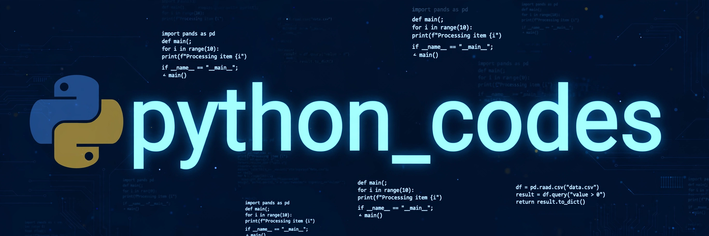

# python_codes

> ## Status: 🟡 In Progress
>
> <progress value="25" max="100"></progress>
>
> **Progress: 25%** — one practice file with Python basics; every line is commented out, nothing runs yet

<p align="center">
  
</p>


## What it is

A personal Python practice file (`basic.py`, 234 lines) collecting beginner exercises: print statements, user input, type casting, string/character handling, averages with the `statistics` module, and loops. Every snippet is currently commented out — it's a notes-style playground for learning Python fundamentals, not a runnable program.

## What works (verified)

- ✅ File parses as valid Python — verified with `python3 -m py_compile basic.py` (compiles cleanly since all code is commented)
- ✅ Snippet topics cover print, input, int/float/str/bool casting, and `statistics.mean` — verified by reading the file

## Tech stack

| Layer | Technology |
|---|---|
| Language | Python 3 (standard library only) |
| Dependencies | None |

## How to run

There is no runnable code yet — every line is commented. To try the snippets, uncomment a block and run:

```bash
python3 basic.py
```

## Screenshots

No UI — this is a code practice file. The banner above is the visual.

## What you can add more

- [ ] Uncomment the snippets one topic at a time and verify each runs — turn notes into working examples
- [ ] Split into one file per topic (`input_output.py`, `type_casting.py`, `statistics_demo.py`) — easier to navigate than a single commented file
- [ ] Add a small project that uses the basics together (e.g. a marks calculator or number guessing game) — proves the concepts work end to end
- [ ] Add docstrings/comments explaining each concept instead of commenting the code itself

## Project structure

```
python_codes/
├── banner.webp   # project banner
├── basic.py      # 234 lines of commented Python practice snippets
└── README.md
```

---
*README written after code audit on 2026-10-08.*
